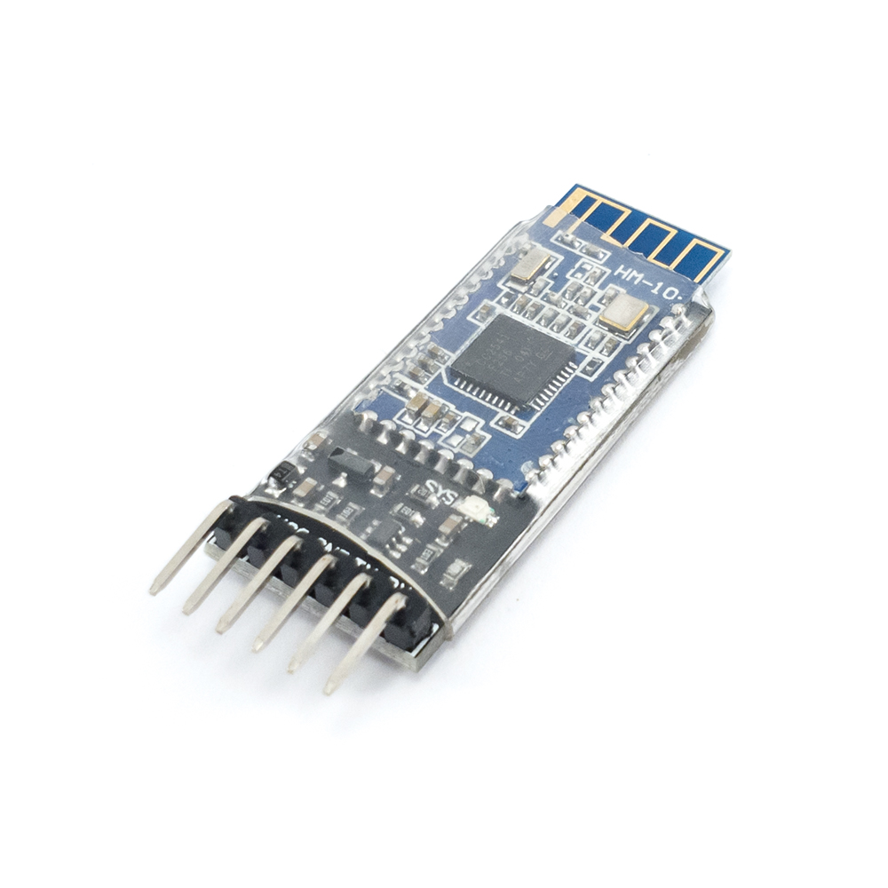

.. _ble_module:

Bluetooth Low Energy Module (HM-10)
===================================

.. _ble_and_radio_tech:

BLE and Radio Technologies
--------------------------

RC cars use radio signals to transmit data between the car and the controller (in our case a mobile app). Some popular radio technologies that can be used are Bluetooth and Wi-Fi. Our example project uses the Bluetooth Low Energy (BLE) protocol as it is supported by most modern phones and is designed to be energy efficient.

.. _ble_module_discussion:

BLE Modules
-----------

    HM-10 BLE Module

We use an HM-10 BLE module which receives wireless signals from our mobile app and sends them to the microcontroller via a wired connection. Some microcontrollers like the ESP32 come with built-in Bluetooth, eliminating the need for a separate module.

.. _bc_vs_ble:

Bluetooth Classic vs. Bluetooth Low Energy
------------------------------------------

It is important to note that Bluetooth (also known as 'Bluetooth Classic') and Bluetooth Low Energy (BLE) are two different protocols. So while there are "Bluetooth" devices like the ESP32 that support both protocols, that is not always the case. For example, the HM-10 module only supports BLE. The following table shows some of the fundamental differences between the two protocols:

.. list-table:: Comparison between Bluetooth Classic and Bluetooth Low Energy
    :widths: auto
    :header-rows: 1

    * 
        - Bluetooth Classic
        - Bluetooth Low Energy
    * 
        - Faster data transfer speeds
        - Slower data transfer speeds
    * 
        - Consumes more power
        - Is more power efficient
    * 
        - Used most when data needs to be streamed continuously, e.g Bluetooth headphones
        - Used most when data is transferred periodicaly, e.g fitness trackers
