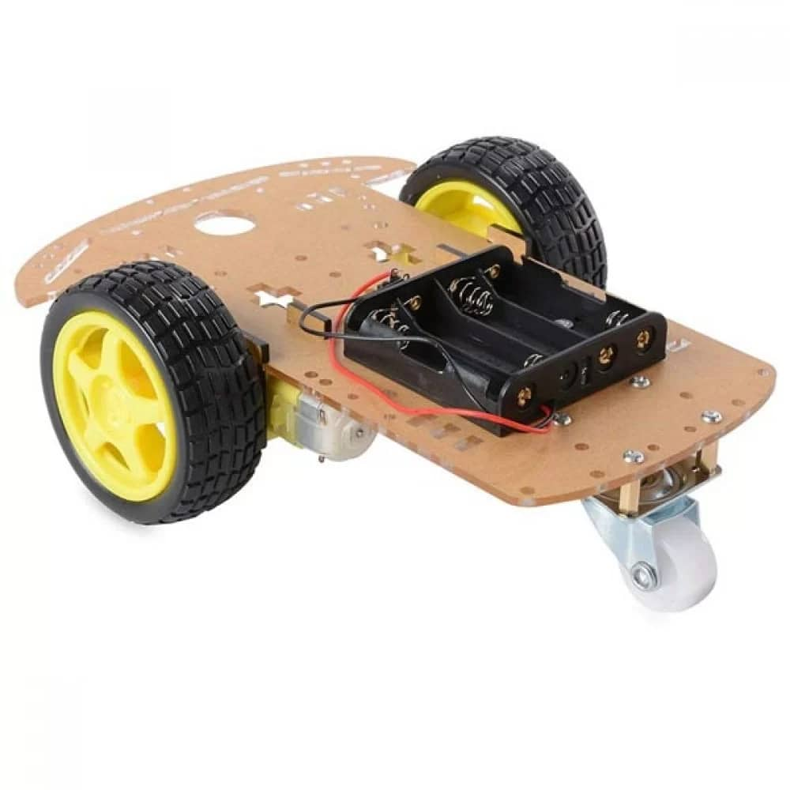

.. _car_chassis:

Car Chassis
===========

.. _chassis_description:

Chassis Description
-------------------

In our example project, our car's chassis consists of the car frame and its wheels. In more advanced projects like consumer grade cars, the chassis would also include things like wheel suspension and shock absorption systems.

The example project uses a pre-made acrylic frame that supports two motorized wheels and one smaller front wheel. The rear wheels control the car's movement while the front wheel provides stability. All our other components are placed on top of the chassis.

    Acrylic car chassis

.. _chassis_responsibilities:

Responsibilities of the chassis
-------------------------------

The car chassis needs to support the size and weight of all our other components without restricting the car's movement. Our example car violates this principle as the microcontroller board is hanging off the rear of the chassis. This means we risk damaging the microcontroller board if the car bumps into something from behind. To address this issue in the future, we can use either a bigger chassis and/or smaller components.

    Microcontroller board hanging off the rear of the car (bad practice)