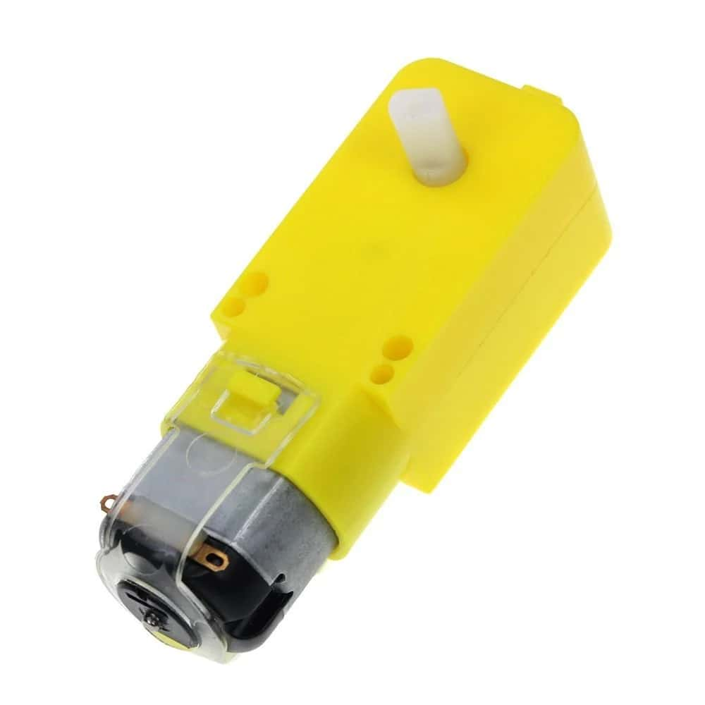
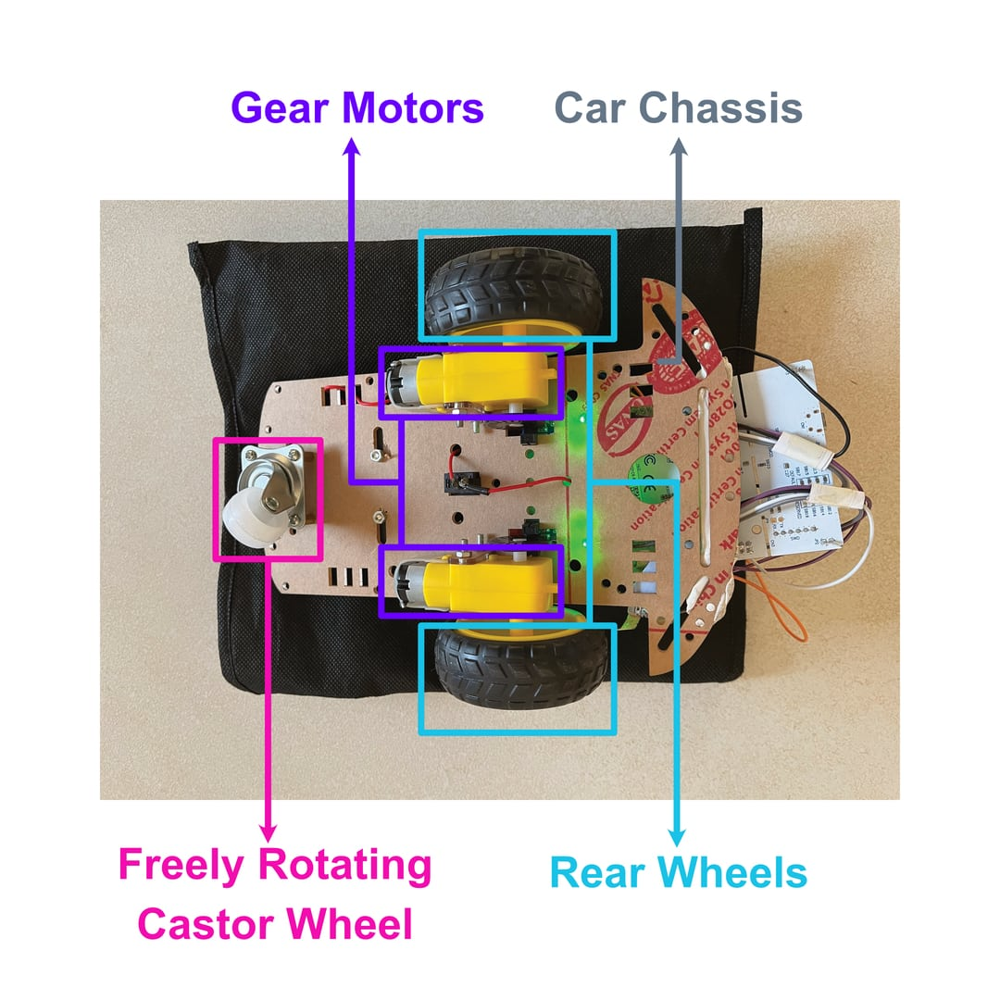

.. _gear_motors:

Gear Motors
===========

.. _motor_description:

Gear Motor Description
----------------------

    Typical DC Gear Motor

DC gear motors take electrical energy and convert it into spinning motion. The more power we deliver to a motor, the faster it spins. 

Our example car uses two independent DC gear motors to spin the rear wheels, making the car a two-wheel drive (2WD). If we provide equal power to both motors, then theoretically the car should move in a straight line. If we now reverse the direction of current on both motors, then the car should move in a straight line, but in the opposite direction.

.. _turning_car:

Turning the car
---------------

..
    may need to attach image of an axle here to be more clear

What if we want to turn the car? Traditionally a car's front wheels are attached to an axle that controls the steering. However, our car doesn't have an axle. Instead, our front wheel is a freely-rotating castor wheel like those you find on office chairs—so we can't use it to steer the car. Instead we can steer the car by supplying power to our rear wheels in unequal amounts. If we're moving the car in a straight line, we can reduce power to the left wheel and this will steer the car left.

..
    I think it would help to have the image of the bottom view of the car again here

    Labelled Bottom-view of the car (including wheels and gear motors)