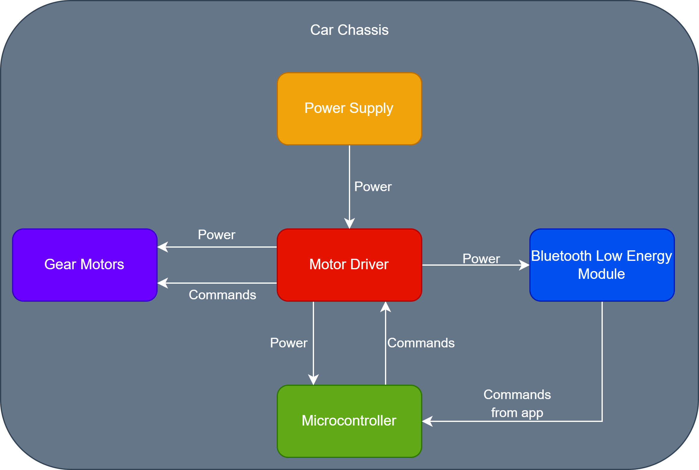
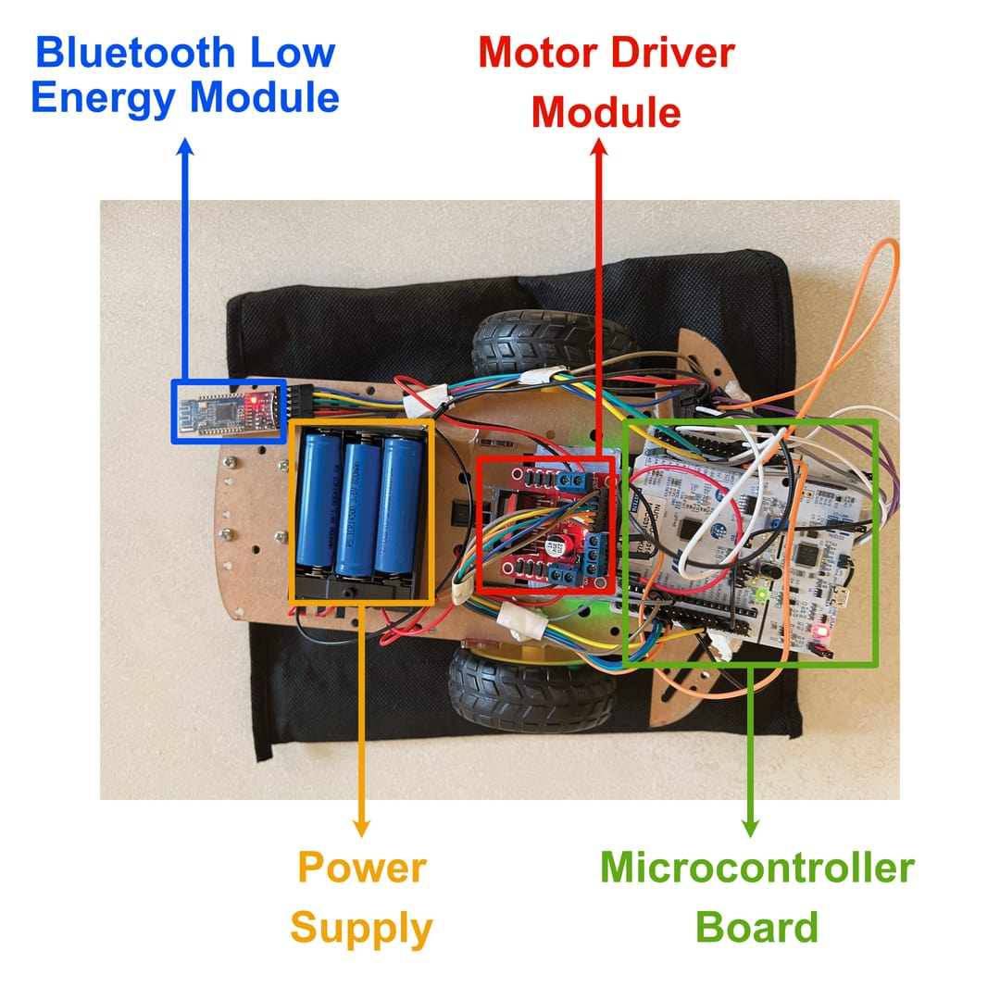

.. _hardware_overview:

Hardware Overview
=================

The hardware consists of all the physical components that make up the car.

.. _hardware_list:

List of main hardware components
--------------------------------

The hardware is made up of the following components:

- :doc:`chassis`
- :doc:`microcontroller`
- :doc:`gear-motors`
- :doc:`motor-driver`
- :doc:`power-supply`
- :doc:`ble-module`

.. _hardware_relationships:

Relationships between hardware components
-----------------------------------------

    Diagram showing the relationships between the hardware components.

.. _car_top_view:

Top-view of the car
-------------------

    Labelled top-view of the car

.. _car_bottom_view:

Bottom-view of the car
----------------------

.. figure:: ../../../media/images/car_bottom_annotated.jpg
    :width: 800

    Labelled bottom-view of the car