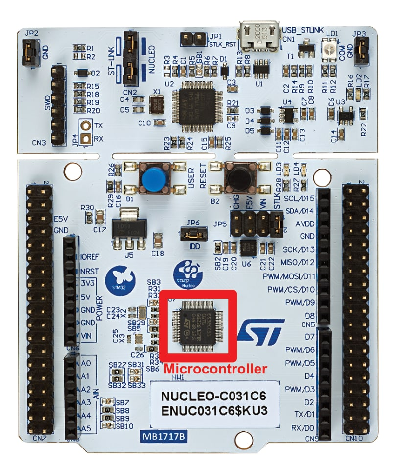

.. _microcontroller:

Microcontroller (STM32 NUCLEO-C031C6)
=====================================

.. _microcontroller_description:

Microcontroller Descriptions
----------------------------

The microcontroller is the "brain" of our car. Microcontrollers are tiny programmable computers that we use to process data in electronic systems. They read incoming signals, make decisions based on that input and then send outgoing signals to other components. In our case, the microcontroller receives remote control signals and uses those to decide how the car should move.

.. _microcontroller_boards:

Microcontroller Boards
----------------------

When prototyping, we usually use "microcontroller boards" which integrate the microcontroller with supporting components. These boards makes it easier to both program the microcontroller and connect it to our overall circuit. When taking a project from prototype to production, it's common to develop a custom circuit board  which includes only the components necessary to the project.

    Location of the STM32 Microcontroller on a NUCLEO-C031C6 "microcontroller board"

.. _microcontroller_types:

Types of Microcontrollers
-------------------------

Our example project uses an STM32 NUCLEO-C031C6 board. STM32 NUCLEO boards have a built-in debugging circuit that can help troubleshoot problems during development. STM32 microcontrollers are popular in industry because they're available in many variations. This gives designers the freedom to pick the microcontroller that best fits their project. If design requirements change and the chosen microcontroller isn't suitable anymore, it's relatively easy to pick another STM32 microcontroller that is. This helps avoid extensive redesign work in complex projects.

However for hobbyist projects, Arduino and ESP32 microcontroller boards are more popular because they're easy to use and they have many educational resources available. An ESP32 board is a good choice for an RC car prototype as it is relatively cheap and comes with an integrated Bluetooth module.
