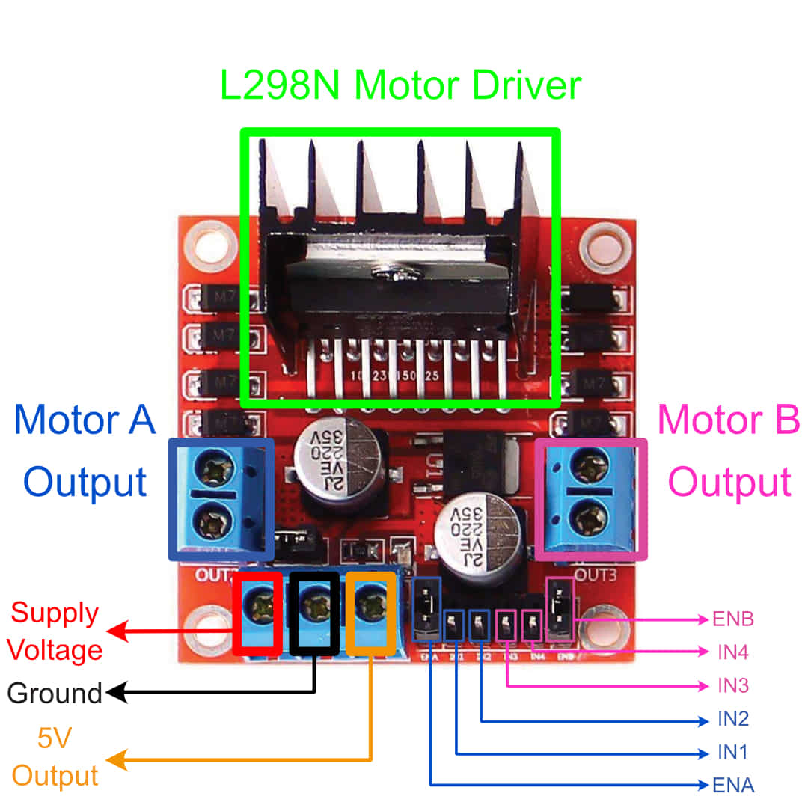

.. _motor_driver:

Motor Driver (L298N Module)
===========================

.. _driver_description:

Motor Driver Description
------------------------

Motor drivers are circuits that help control motor speed and direction. They're the bridge between microcontrollers and motors—using input signals from the microcontroller to control motors. Motor drivers are used because microcontrollers cannot output enough power to spin motors on their own.

.. _l298n_description:

L298N Module Description
------------------------

    Labelled view of the L298N motor driver module

Our example car uses an L298N motor driver module to control the two rear wheels. The L298N takes the following inputs:

- **ENA** and **ENB**: these inputs determine whether motors A and B are enabled. They're also used to control motor speed.
- **IN1** and **IN2**: these inputs control the direction of motor A
- **IN3** and **IN4**: these inputs control the direction of motor B

In :ref:`firmware_motor_control`, there is a more detailed explanation of how these inputs control the motors.

Also note that motor drivers use "H-Bridge" circuits to control a motor's spin direction. The L298N contains two H-Bridge circuits, allowing motor A and B's directions to be controlled independently.

The interactive demo below shows how H-Bridges work by using Motor A's inputs as an example.

.. raw:: html
    :file: ../_demos_/h-bridge-demo.html

..
    Want to have an infographic of how these H-Bridges work

.. _driver_power_management:

Power Management
----------------

Motors drivers usually require more power than microcontrollers. So if you use the same power supply for both, you could damage the microcontroller if you supply too much voltage. To avoid the need for two power supplies, the L298N module comes with an onboard 5V voltage regulator. It takes an input voltage (7V-12V) and outputs a stable 5V that we can use to power microcontrollers and other low-power components. This lets us use a single power supply, making the L298N module a good motor driver for prototyping—especially if you're still unsure of your power requirements.

Other popular motor drivers are the DRV8833 and the MX1508. They offer different tradeoffs in terms of cost and power.