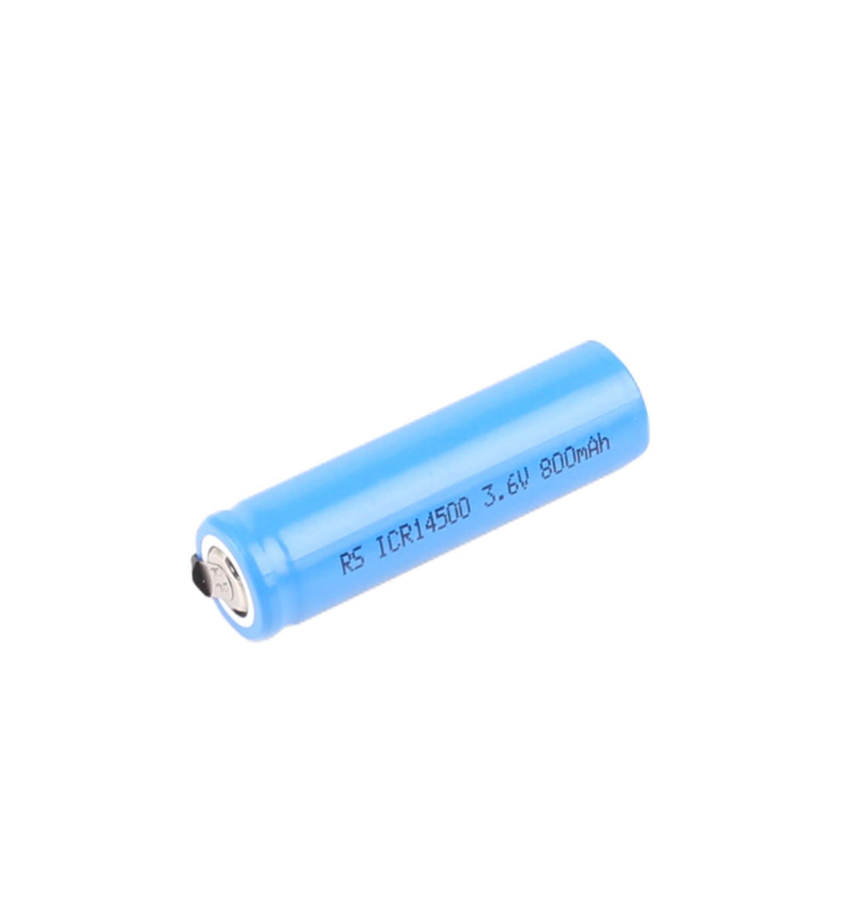

.. _power_supply:

Power Supply ('14500' Lithium-ion batteries)
============================================

.. _battery_description:

Battery Description
-------------------

Batteries are devices that convert chemical energy into electrical energy. They supply the energy needed to power RC cars and other portable electronics. There are different types of batteries, each with their own chemical composition. The chemical composition determines the battery's energy capacity, power output and whether it can be recharged.

.. _lithium_ion_batteries:

Lithium-ion Batteries
---------------------

    '14500' Lithium-ion battery

Lithium-ion batteries (like those in our example car) are rechargeable and also have have a high energy density—meaning more energy can be stored in smaller battery cells. Our car uses three '14500' battery cells connected in series. Each cell provides ~3.6V when fully charged, giving us a total of 10.8V to power our L298N motor driver. We then use the L298N's voltage regulator to output 5V to power our other electronic components.

14500 batteries get their name from their physical dimensions—14mm diameter and 50mm height. They have a similar size to AA batteries, so our car uses a AA battery holder which has been slightly modified to ensure the battery terminals make proper contact. 

While 14500 batteries have a higher voltage than AA batteries, they also usually have less energy capacity. If you need a higher energy capacity and are willing to use slightly bigger batteries, then the 18650 battery is a popular alternative to the 14500.
