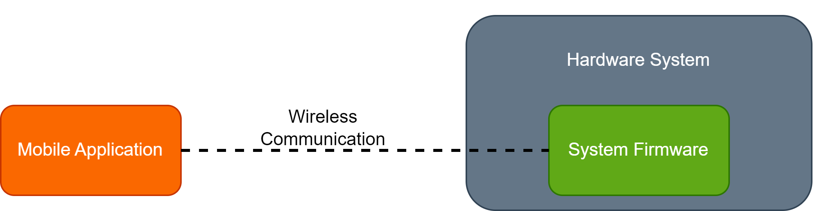

.. _project_overview:

Project Overview
================

.. _project_description:

Project Description
-------------------

The example project discussed in this document is an RC car that is controlled by a mobile app. The mobile app and the RC car communicate via Bluetooth Low Energy (BLE).

.. video:: ../../../media/videos/car_action_comp.mp4
   :width: 300
   :autoplay:

.. _system_overview:

System Overview
---------------

The project consists of three systems:

- :ref:`Hardware System <hardware_overview>`: the electrical and mechanical components that form the physical car.
- :ref:`Mobile Application <app_overview>`: an Android/iOS application that sends commands to the car via BLE.
- :ref:`System Firmware <firmware_overview>`: the software program running on the RC car. It receives BLE signals from the mobile app and uses those to determine how the car should move.

   Diagram showing the relationships between the three systems.