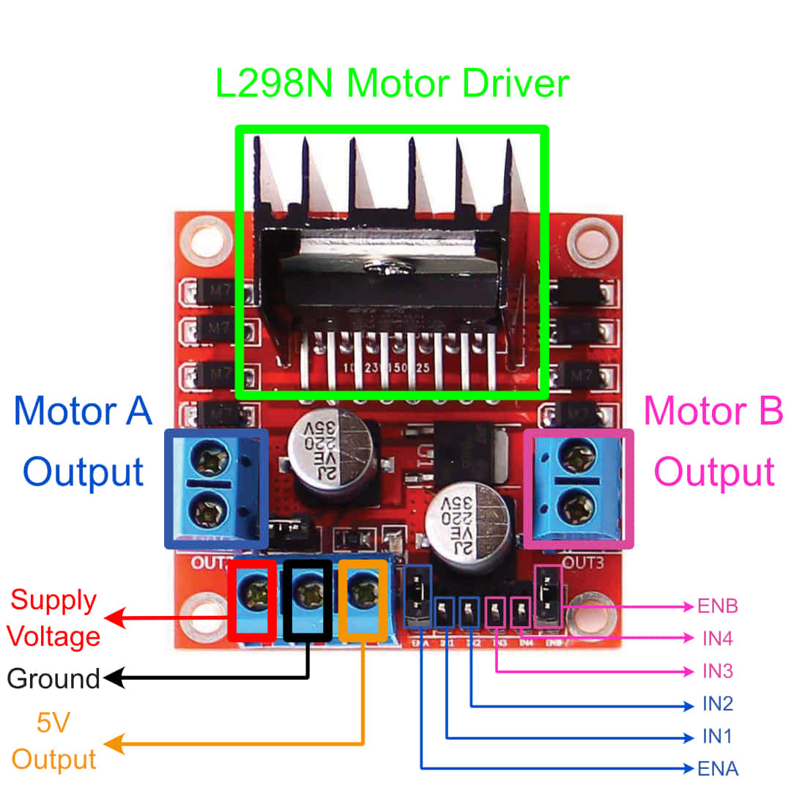

.. _firmware_motor_control:

Motor Control and PWM
=====================

Binary Representation
---------------------

You might have heard that computers "think in 1s and 0s". What this means is that in computing, everything is represented as a series of HIGH signals (1s) and LOW signals (0s). In digital electronics, a signal is a voltage level that is used to represent information. A LOW signal is typically a voltage close to 0V, while a HIGH signal is typically a voltage that is near the supply voltage of the microcontroller (usually around 3.3V or 5V). This representation of data as 1s and 0s is known as a binary representation.

.. _motor_driver_inputs:

Motor Driver Inputs
-------------------

    Labelled view of the L298N motor driver module and its inputs

In :doc:`../hardware-system/motor-driver`, we said that the L298N motor driver has inputs that are used to control motor speed and direction. These inputs take in either HIGH signals or LOW signals. 

The inputs **IN1**, **IN2**, **IN3**, and **IN4** control the spinning direction of the motors. 

The inputs **ENA** and **ENB** determine whether the motors should be powered on. A HIGH signal enables a motor while a LOW signal disables it.

As indicated in the diagram above:

- Motor A is affected by inputs **ENA**, **IN1**, and **IN2**
- Motor B is affected by inputs **ENB**, **IN3**, and **IN4**

The following table shows the effect that the different inputs have on a motor:

.. list-table:: Effect of L298N input signals on a single motor
    :widths: auto
    :header-rows: 1

    *
        - EN
        - INx
        - INy
        - Result
    *
        - LOW
        - N/A
        - N/A
        - Motor is Off
    *
        - HIGH
        - LOW
        - LOW
        - Motor stops
    *
        - HIGH
        - HIGH
        - LOW
        - Motor spins forward
    *
        - HIGH
        - LOW
        - HIGH
        - Motor spins backward
    *
        - HIGH
        - HIGH
        - HIGH
        - Motor stops

.. _speed_control_and_pwm:

Speed Control and PWM
---------------------

What if we want to control the speed of the motors? We would need to vary the voltage level used to power the motors, meaning we need to somehow send a value that is between HIGH and LOW. We can do this using a technique called Pulse Width Modulation (PWM). PWM is a technique where we switch between HIGH and LOW signals at very fast speeds (*hundreds or even thousands of times per second*). This creates an effect similar to sending the averaged value of the HIGH and LOW signals. 

By varying the duty cycle (the percentage of time that the signal is HIGH vs LOW), we can affect what the averaged value of the signal is. For example, if the microcontroller sends a HIGH signal as 5V and a LOW signal as 0V, then a PWM signal with a 25\% duty cycle would be equivalent to sending 1.25V.

The interactive demo below shows how the PWM signal's average value changes with the duty cycle.

.. raw:: html
    :file: ../_demos_/pwm-demo.html